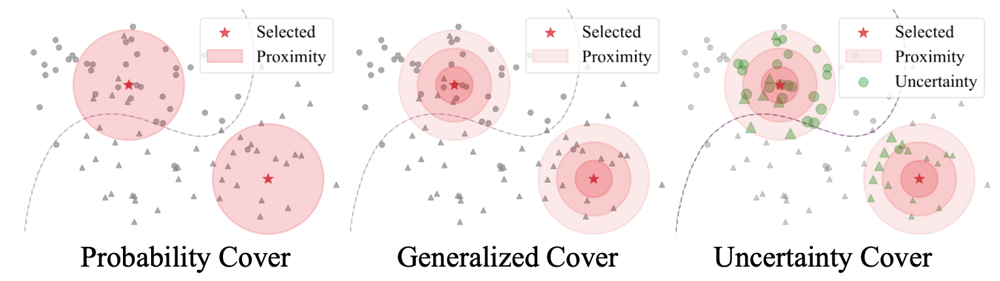
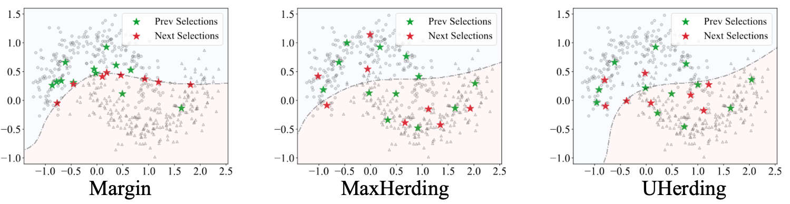

# Uncertainty Herding: One Active Learning Method for All Label Budgets
[[arXiv](https://arxiv.org/abs/2412.20644)]
[[OpenReview](https://openreview.net/forum?id=UgPoHhYQ2U)]

Note that this repository also contains code for MaxHerding: Bae et al., "Generalized Coverage for More Robust Low-Budget Active Learning", ECCV 2024 [[arXiv](https://arxiv.org/abs/2407.12212)]

## Overview
Uncertainty herding (UHerding) is a greedy active selection method that maximizes uncertainty coverage described in the figure below.



Uncertainty-based methods e.g. Margin selects data points near the predicted decision boundary whereas representation-based methods e.g. MaxHerding selects data points to maximally cover data distribution. On the other hand, UHerding selects data points that maximally covers the most uncertain data points.




## Setup
Please install the required packages.
```
pip install -r requirements.txt
```
Create directories for data and outputs. Please locate your datasets in the `data` directory.
```
mkdir data output
```


## Extract Features
Following the previous works e.g. Typiclust and ProbCover, we extract features using unsupervised learning models like SimCLR.
To extract SimCLR features on CIFAR10, use the following command.
```
cd scan
python simclr.py --config_env configs/env.yml --config_exp configs/pretext/simclr_cifar10.yml
```


## Usage
To run UHerding, run the following command
```
cd deep-al/tools
bash scripts/run_budget.sh -b 20_5_100_9_1000_9 -a uherding_margin -s true -p true
```
where `20_5_100_9_1000_9` means selecting data points `[20, 40, 60, 80, 100]` in the low-budget regime, `[200, 300, ..., 1000]` in the mid-budget regime, and `[2000, 3000, 10000]` in the high-budget regime. With `-s true`, it uses temperate scaling and with `-p true`, it uses adaptive radius. For more details, please refer to `run_budget.sh`.

Similarly, for fine-tuning, please use `scripts/run_budget_ft.sh` instead.


## Citation
This Repository is based on multiple repositories: [[Typiclust & ProbCover](https://github.com/avihu111/TypiClust), [SCAN](https://github.com/wvangansbeke/Unsupervised-Classification) and [Deep-AL](https://github.com/acl21/deep-active-learning-pytorch)].
Please consider citing their works and ours:


```
@inproceedings{bae2025uncertainty,
  title={Uncertainty Herding: One Active Learning Method for All Label Budgets},
  author={Bae, Wonho and Sutherland, Danica J and Oliveira, Gabriel L},
  booktitle={ICLR},
  year={2025}
}

@inproceedings{bae2024generalized,
  title={Generalized Coverage for More Robust Low-Budget Active Learning},
  author={Bae, Wonho and Noh, Junhyug and Sutherland, Danica J},
  booktitle={ECCV},
  year={2024}
}
```

## Acknowledgement
This work is built on [Typiclust & ProbCover](https://github.com/avihu111/TypiClust). We highly appreciate the authors to make their code publicily available.
The code for scan is heavily based on its official code ([SCAN](https://github.com/wvangansbeke/Unsupervised-Classification)).
